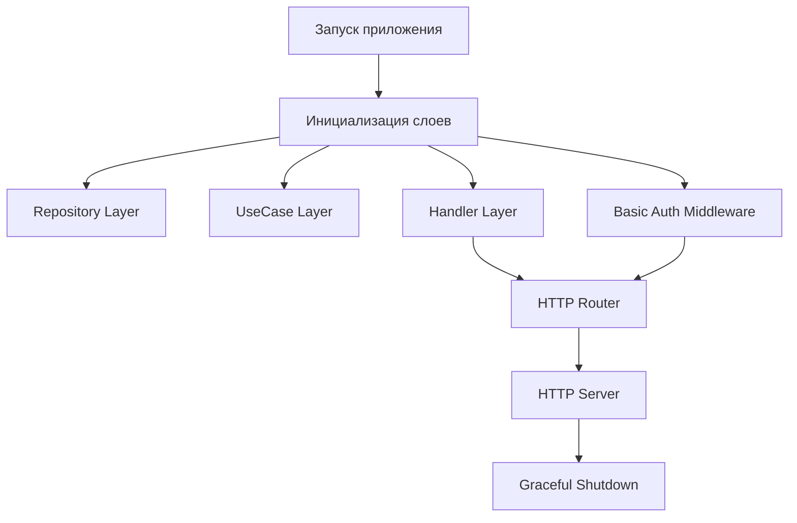
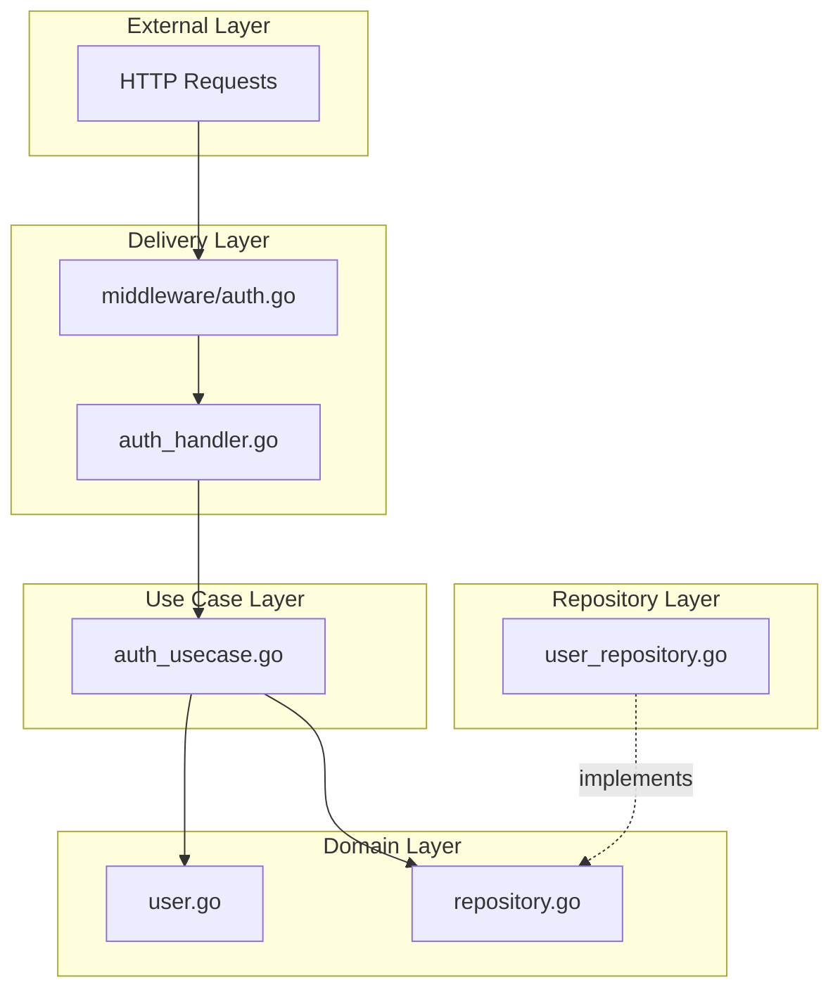
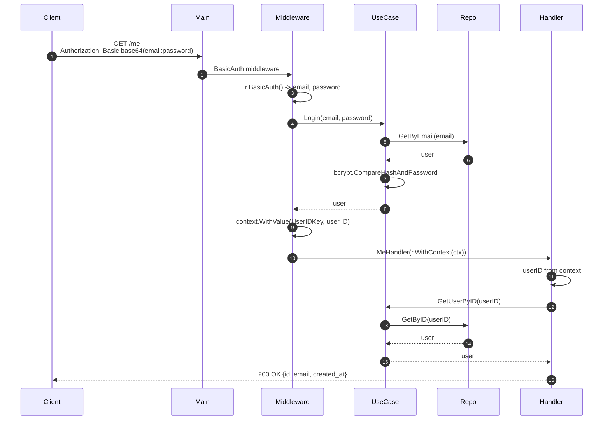

# Архитектура: 01 — Basic Auth (Base64)

## Содержание

1. [Обзор проекта](#обзор-проекта)
2. [Basic Auth: как это работает](#basic-auth-как-это-работает)
3. [Точка входа: main.go](#точка-входа-maingo)
4. [Clean Architecture](#clean-architecture)
5. [Domain Layer (Доменный слой)](#domain-layer-доменный-слой)
6. [Repository Layer (Слой данных)](#repository-layer-слой-данных)
7. [Use Case Layer (Бизнес-логика)](#use-case-layer-бизнес-логика)
8. [Delivery Layer (HTTP и Middleware)](#delivery-layer-http-и-middleware)
9. [Полный Flow запроса](#полный-flow-запроса)
10. [Зависимости между слоями](#зависимости-между-слоями)
11. [Преимущества архитектуры](#преимущества-архитектуры)
12. [Резюме](#резюме)

---

## Обзор проекта

Этот мини-проект реализует **HTTP Basic Authentication** (RFC 7617): клиент передаёт логин и пароль в заголовке `Authorization` в каждом запросе к защищённым эндпоинтам. Регистрация — по JSON (email + password); доступ к `/me` и удаление аккаунта — только с Basic Auth. Пароли хранятся в виде bcrypt-хеша.

### Структура файлов

```
01-basic-auth/
├── cmd/
│   └── server/
│       └── main.go                          # Точка входа приложения
├── internal/
│   ├── domain/                              # Бизнес-модели и интерфейсы
│   │   ├── user.go                          # Модель User
│   │   └── repository.go                    # Интерфейс UserRepository
│   ├── repository/
│   │   └── memory/
│   │       └── user_repository.go           # In-memory реализация
│   ├── usecase/
│   │   └── auth_usecase.go                  # Регистрация, логин, bcrypt
│   └── delivery/
│       ├── auth_handler.go                  # HTTP handlers
│       └── middleware/
│           └── auth.go                       # Basic Auth middleware
├── go.mod
└── go.sum
```

---

## Basic Auth: как это работает

**RFC 7617** описывает схему «Basic»: клиент кодирует строку `email:password` в **Base64** и отправляет в заголовке:

```
Authorization: Basic <base64(email:password)>
```

**Зачем Base64:** не для шифрования (Base64 легко декодируется), а чтобы в заголовке не было пробелов и спецсимволов — формат безопасен для HTTP. Сама защита — только по **HTTPS**: иначе credentials передаются открытым текстом.

**В нашем приложении:**

- Отдельного эндпоинта `POST /login` нет: «вход» происходит при каждом запросе к защищённому роуту.
- Middleware читает заголовок `Authorization`, вызывает `r.BasicAuth()` (стандартный парсинг в Go), получает email и password, проверяет их через use case (bcrypt), и при успехе кладёт `user_id` в context. Дальше handler берёт user из контекста.

---

## Точка входа: main.go

### Что создано в main.go



### Пошаговое объяснение main.go

#### 1. Health Check Handler

```go
func healthHandler(w http.ResponseWriter, r *http.Request) {
    w.Header().Set("Content-Type", "application/json")
    w.WriteHeader(http.StatusOK)
    json.NewEncoder(w).Encode(map[string]string{"status": "ok"})
}
```

**Зачем:** проверка работоспособности сервера, мониторинг (Kubernetes, Load Balancers), быстрый тест: `curl http://localhost:8080/health`.

#### 2. Инициализация слоёв и Basic Auth middleware

```go
userRepository := memory.NewUserRepository()
authUsecase := usecase.NewAuthUsecase(userRepository)
authHandler := delivery.NewAuthHandler(authUsecase)
basicAuthMiddleware := middleware.BasicAuth(authUsecase)
```

**Зачем:** Dependency Injection: каждый слой получает зависимости через конструктор. Middleware получает use case, чтобы по email+password из Basic Auth вызвать логин (проверка bcrypt) и положить user ID в context.

#### 3. Публичные и защищённые роуты

```go
// Public routes
mux.HandleFunc("/health", healthHandler)
mux.HandleFunc("POST /api/v1/auth/register", authHandler.RegisterHandler)

// Protected routes (require Basic Auth header)
mux.Handle("GET /api/v1/auth/me", basicAuthMiddleware(http.HandlerFunc(authHandler.MeHandler)))
mux.Handle("DELETE /api/v1/auth/me", basicAuthMiddleware(http.HandlerFunc(authHandler.DeleteUserHandler)))
```

**Зачем:** разделение на публичные (без авторизации) и защищённые роуты. Для защищённых оборачиваем handler в `basicAuthMiddleware`: сначала проверяется Basic Auth, только потом вызывается handler. Отдельного `POST /login` нет — авторизация при каждом запросе через заголовок.

#### 4. HTTP Server и Graceful Shutdown

Как в корневом проекте: таймауты (ReadTimeout, WriteTimeout, IdleTimeout), запуск сервера в goroutine, ожидание SIGINT, `Shutdown(ctx)` с таймаутом 10 секунд.

---

## Clean Architecture

Слои и правила те же: Domain не зависит ни от чего; Use Case зависит только от Domain; Delivery и Repository зависят от Use Case и Domain. Слой доставки дополнен **middleware** для Basic Auth.



---

## Domain Layer (Доменный слой)

### domain/user.go — модель пользователя

```go
type User struct {
    ID        string    `json:"id"`
    Name      string    `json:"name"`
    Email     string    `json:"email"`
    Password  string    `json:"-"`           // НЕ возвращается в JSON
    CreatedAt time.Time `json:"created_at"`
}
```

**Зачем каждое поле:** ID — UUID; Email — уникальный логин; Password — хеш bcrypt, в JSON не отдаётся (`json:"-"`); CreatedAt — дата регистрации.

### domain/repository.go — интерфейс хранилища

```go
type UserRepository interface {
    Create(user *User) error
    GetByID(id string) (*User, error)
    GetByEmail(email string) (*User, error)
    Delete(id string) error
}
```

**Зачем интерфейс:** абстракция над хранилищем, подмена на postgres/redis/mock без изменения use case.

---

## Repository Layer (Слой данных)

### repository/memory/user_repository.go

In-memory реализация: `map[string]*domain.User`, защита `sync.RWMutex` при конкурентном доступе. Методы: Create (Lock), GetByID/GetByEmail (RLock), Delete (Lock). GetByEmail — перебор по map (O(n)); в БД будет индекс по email.

---

## Use Case Layer (Бизнес-логика)

### auth_usecase.go

**Register:** проверка существования по email, генерация bcrypt-хеша пароля, создание User с UUID, сохранение в repository.

**Зачем bcrypt в Register:**

```go
hashedPassword, err := bcrypt.GenerateFromPassword([]byte(password), bcrypt.DefaultCost)
```

Пароли не хранятся в открытом виде; при утечке БД хеши не дают восстановить пароль. bcrypt — адаптивный алгоритм (замедляет перебор).

**Login:** поиск пользователя по email, проверка пароля через `bcrypt.CompareHashAndPassword`. Одинавое сообщение при «user not found» и «wrong password» — защита от user enumeration.

**GetUserByID, DeleteUserById:** передача вызова в repository.

---

## Delivery Layer (HTTP и Middleware)

### auth_handler.go

- **RegisterHandler:** парсит JSON (email, password), вызывает use case Register, возвращает 201 и user (без пароля) или 409/500.
- **MeHandler:** достаёт `user_id` из `r.Context().Value(middleware.UserIDKey)` — его положил middleware после успешной Basic Auth; вызывает GetUserByID, отдаёт 200 и user или 401/404.
- **DeleteUserHandler:** так же берёт user_id из context, вызывает DeleteUserById, возвращает 204.

**Зачем user_id из context:** защищённые роуты не принимают user_id в query/body — только через middleware, чтобы нельзя было подделать запрос от другого пользователя.

### middleware/auth.go — Basic Auth

```go
func BasicAuth(authUsecase *usecase.AuthUsecase) func(http.Handler) http.Handler {
    return func(next http.Handler) http.Handler {
        return http.HandlerFunc(func(w http.ResponseWriter, r *http.Request) {
            email, password, ok := r.BasicAuth()
            if !ok {
                w.Header().Set("WWW-Authenticate", `Basic realm="Restricted"`)
                http.Error(w, "Authorization required", http.StatusUnauthorized)
                return
            }

            user, err := authUsecase.Login(email, password)
            if err != nil {
                w.Header().Set("WWW-Authenticate", `Basic realm="Restricted"`)
                http.Error(w, "Invalid credentials", http.StatusUnauthorized)
                return
            }

            ctx := context.WithValue(r.Context(), UserIDKey, user.ID)
            next.ServeHTTP(w, r.WithContext(ctx))
        })
    }
}
```

**Что делает:** `r.BasicAuth()` декодирует заголовок `Authorization: Basic ...` в email и password. Если заголовка нет или логин/пароль неверны — 401 и заголовок `WWW-Authenticate` (по стандарту браузер может показать форму ввода). При успешном Login кладём user.ID в context и вызываем следующий handler.

---

## Полный Flow запроса

### Пример: GET /api/v1/auth/me с Basic Auth



По шагам: клиент отправляет GET с Basic Auth; middleware парсит заголовок, вызывает Login (GetByEmail + bcrypt), при успехе кладёт user_id в context и передаёт управление MeHandler; handler читает user_id из context, запрашивает user и отдаёт JSON.

---

## Зависимости между слоями

Направление зависимостей: HTTP → Middleware → Handler → UseCase → Domain; Repository реализует интерфейс Domain. Use Case не знает о HTTP и о том, что авторизация идёт через Basic Auth — только проверяет email+password.

---

## Преимущества архитектуры

- **Тестируемость:** можно мокировать UserRepository и вызывать Use Case без HTTP.
- **Гибкость:** замена memory на postgres только в main.go.
- **Читаемость:** один слой — одна ответственность; Basic Auth изолирован в middleware.

---

## Резюме

**Реализовано:** Basic Auth (RFC 7617), bcrypt для паролей, разделение публичных и защищённых роутов, middleware с передачей user_id через context, Clean Architecture с domain/use case/repository/delivery.

**Следующий проект в коллекции:** [02-api-key](../02-api-key/) — авторизация по заголовку X-API-Key.
