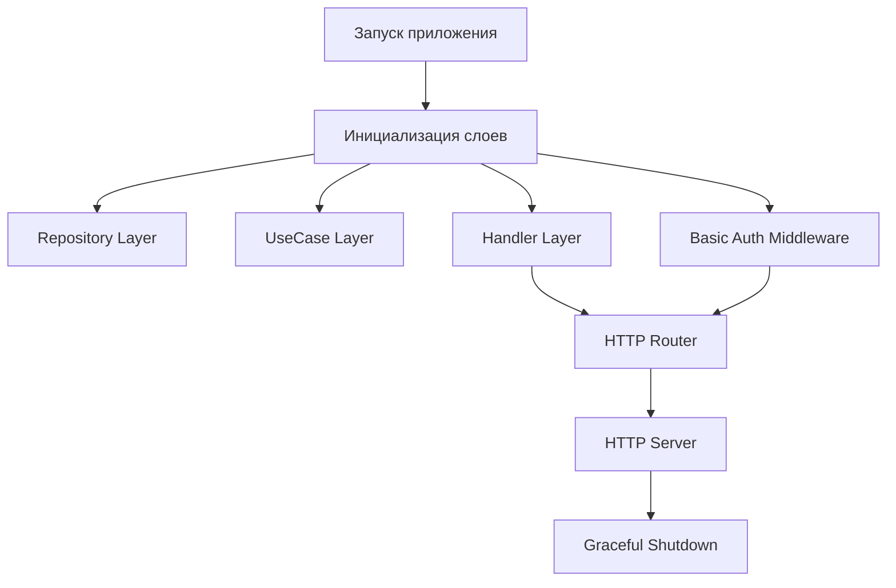
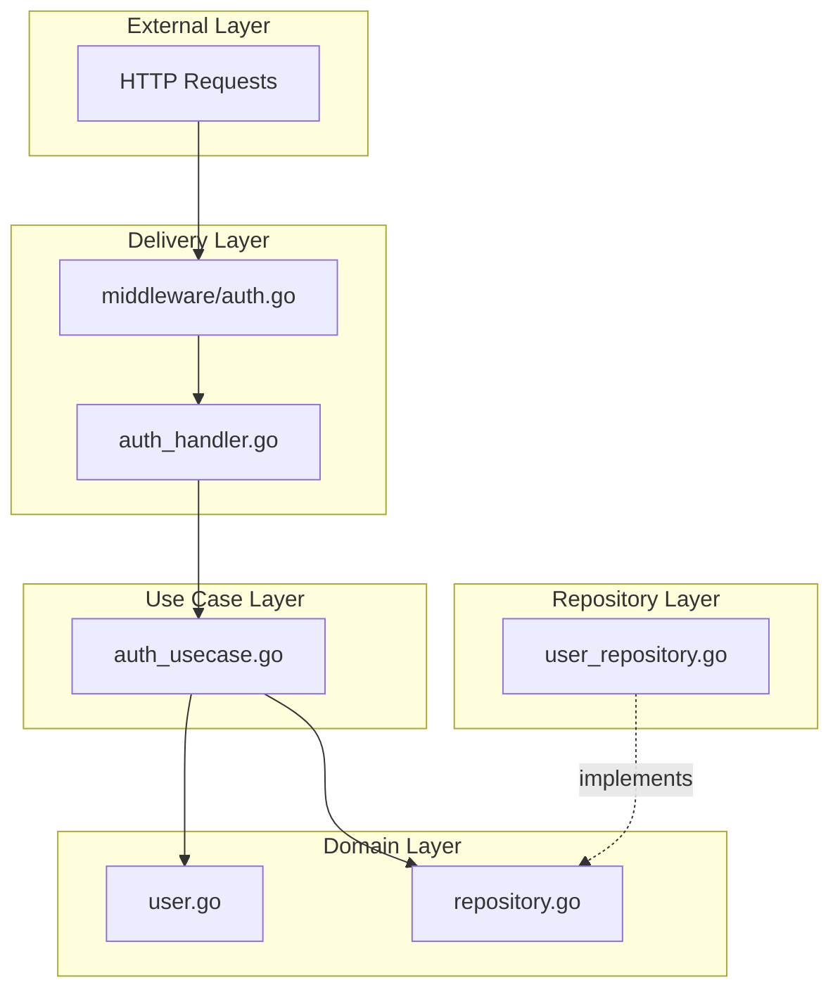

# Архитектура: 01 — Basic Auth (Base64) — Go

## Содержание

1. [Обзор проекта](#обзор-проекта)
2. [Basic Auth: как это работает](#basic-auth-как-это-работает)
3. [Точка входа: main.go](#точка-входа-maingo)
4. [Clean Architecture](#clean-architecture)
5. [Domain Layer (Доменный слой)](#domain-layer-доменный-слой)
6. [Repository Layer (Слой данных)](#repository-layer-слой-данных)
7. [Use Case Layer (Бизнес-логика)](#use-case-layer-бизнес-логика)
8. [Delivery Layer (HTTP и Middleware)](#delivery-layer-http-и-middleware)
9. [Полный Flow запроса](#полный-flow-запроса)
10. [Зависимости между слоями](#зависимости-между-слоями)
11. [Преимущества архитектуры](#преимущества-архитектуры)
12. [Резюме](#резюме)

---

## Обзор проекта

Этот мини-проект реализует **HTTP Basic Authentication** (RFC 7617) на **Go**: клиент передаёт логин и пароль в заголовке `Authorization` в каждом запросе к защищённым эндпоинтам. Регистрация — по JSON (email + password); доступ к `/me` и удаление аккаунта — только с Basic Auth. Пароли хранятся в виде bcrypt-хеша.

### Структура файлов (Go)

```
01-basic-auth/go/
├── cmd/
│   └── server/
│       └── main.go                          # Точка входа приложения
├── internal/
│   ├── domain/                              # Бизнес-модели и интерфейсы
│   │   ├── user.go                          # Модель User
│   │   └── repository.go                    # Интерфейс UserRepository
│   ├── repository/
│   │   └── memory/
│   │       └── user_repository.go           # In-memory реализация
│   ├── usecase/
│   │   └── auth_usecase.go                  # Регистрация, логин, bcrypt
│   └── delivery/
│       ├── auth_handler.go                  # HTTP handlers
│       └── middleware/
│           └── auth.go                      # Basic Auth middleware
├── go.mod
└── go.sum
```

### Кратко о терминах

- **Credentials (учётные данные)** — пара «логин + пароль», которой пользователь доказывает, что он тот, за кого себя выдаёт.
- **Middleware** — код, который выполняется до основного handler’а: например, проверяет авторизацию и только потом передаёт запрос дальше.
- **Context** — в Go это способ передать по цепочке вызовов значения (например, ID пользователя после проверки Basic Auth), не трогая сигнатуры функций.
- **Handler** — функция, которая обрабатывает HTTP-запрос: читает тело/заголовки, вызывает бизнес-логику и формирует ответ.

---

## Basic Auth: как это работает

**RFC 7617** описывает схему «Basic»: клиент кодирует строку `email:password` в **Base64** и отправляет в заголовке:

```
Authorization: Basic <base64(email:password)>
```

### Что такое credentials (учётные данные)

**Credentials** — это пара «кто ты» + «подтверждение личности»: в нашем случае **логин (email) и пароль (password)**. Клиент при каждом запросе к защищённому эндпоинту отправляет их в заголовке; сервер проверяет и решает, дать доступ или нет.

### Зачем Base64 (и почему «без пробелов и спецсимволов»)

Base64 здесь **не для шифрования** — его легко декодировать обратно. Он нужен из-за правил HTTP:

- Заголовки передаются как одна строка; пробелы часто считаются **разделителями** между частями заголовка.
- Символы вроде двоеточия `:` или кавычек могут по-разному обрабатываться серверами и прокси.
- В пароле могут быть пробелы, двоеточия, кириллица — всё это могло бы сломать разбор заголовка.

**Base64** превращает любую строку (в т.ч. `email:password`) в строку только из «безопасных» символов (буквы, цифры, `+`, `/`, `=`). Так значение заголовка передаётся **одним куском**, без неоднозначности. Итог: Base64 — про **безопасный формат для передачи в заголовке**, а не про секретность.

### Про HTTPS и открытый текст

По HTTP заголовки (и тело запроса) идут **открытым текстом**. Значит, и email, и пароль видны любому, кто перехватит трафик. Поэтому Basic Auth имеет смысл только по **HTTPS**: тогда канал шифруется и credentials не светятся в открытую.

### Как устроено у нас

- Отдельного эндпоинта `POST /login` нет: «вход» происходит **при каждом запросе** к защищённому роуту.
- Middleware читает заголовок `Authorization`, вызывает `r.BasicAuth()` (стандартный парсинг в Go), получает email и password, проверяет их через use case (bcrypt), и при успехе кладёт `user_id` в context. Дальше handler берёт user из контекста.

---

## Точка входа: main.go

### Что создано в main.go



### Пошаговое объяснение main.go

#### 1. Health Check Handler

```go
func healthHandler(w http.ResponseWriter, r *http.Request) {
    w.Header().Set("Content-Type", "application/json")
    w.WriteHeader(http.StatusOK)
    json.NewEncoder(w).Encode(map[string]string{"status": "ok"})
}
```

**Зачем:** проверка работоспособности сервера, мониторинг (Kubernetes, Load Balancers), быстрый тест: `curl http://localhost:8080/health`.

#### 2. Инициализация слоёв и Basic Auth middleware

```go
userRepository := memory.NewUserRepository()
authUsecase := usecase.NewAuthUsecase(userRepository)
authHandler := delivery.NewAuthHandler(authUsecase)
basicAuthMiddleware := middleware.BasicAuth(authUsecase)
```

**Зачем:** Dependency Injection: каждый слой получает зависимости через конструктор. Middleware получает use case, чтобы по email+password из Basic Auth вызвать логин (проверка bcrypt) и положить user ID в context.

#### 3. Публичные и защищённые роуты

```go
// Public routes
mux.HandleFunc("/health", healthHandler)
mux.HandleFunc("POST /api/v1/auth/register", authHandler.RegisterHandler)

// Protected routes (require Basic Auth header)
mux.Handle("GET /api/v1/auth/me", basicAuthMiddleware(http.HandlerFunc(authHandler.MeHandler)))
mux.Handle("DELETE /api/v1/auth/me", basicAuthMiddleware(http.HandlerFunc(authHandler.DeleteUserHandler)))
```

**Зачем:** разделение на публичные (без авторизации) и защищённые роуты. Для защищённых **оборачиваем** handler в `basicAuthMiddleware`: при запросе на GET/DELETE `/api/v1/auth/me` сначала вызывается middleware — он проверяет заголовок Basic Auth и только при успехе передаёт управление MeHandler/DeleteUserHandler. Если middleware вернёт 401, handler вообще не вызывается. Отдельного `POST /login` нет — «вход» проверяется при каждом запросе к защищённому пути через заголовок.

#### 4. HTTP Server и Graceful Shutdown

Таймауты (ReadTimeout, WriteTimeout, IdleTimeout), запуск сервера в goroutine, ожидание SIGINT, `Shutdown(ctx)` с таймаутом 10 секунд.

---

## Clean Architecture

Слои и правила те же: Domain не зависит ни от чего; Use Case зависит только от Domain; Delivery и Repository зависят от Use Case и Domain. Слой доставки дополнен **middleware** для Basic Auth.



---

## Domain Layer (Доменный слой)

### Что делает этот слой

Domain описывает **сущности и контракты** приложения: как выглядит пользователь и какие операции с хранилищем нам нужны. Здесь нет кода работы с сетью или БД — только структуры и интерфейсы. Так бизнес-логика не привязана к конкретному способу хранения или доставки.

### domain/user.go — модель пользователя

```go
type User struct {
    ID        string    `json:"id"`
    Name      string    `json:"name"`
    Email     string    `json:"email"`
    Password  string    `json:"-"`           // НЕ возвращается в JSON
    CreatedAt time.Time `json:"created_at"`
}
```

**Зачем каждое поле:**

- **ID** — уникальный идентификатор пользователя (UUID). По нему ищем и обновляем запись; в URL/context передаём именно его.
- **Email** — логин пользователя и уникальный ключ «один email — один аккаунт».
- **Password** — в базе хранится только **хеш** пароля (bcrypt), не сам пароль. Тег `json:"-"` значит: при сериализации в JSON это поле **пропускается**, чтобы пароль нигде не уходил в ответах.
- **CreatedAt** — время регистрации (удобно для отображения и аудита).

### domain/repository.go — интерфейс хранилища

```go
type UserRepository interface {
    Create(user *User) error
    GetByID(id string) (*User, error)
    GetByEmail(email string) (*User, error)
    Delete(id string) error
}
```

**Зачем интерфейс:** use case вызывает только эти методы и не знает, откуда реально берутся данные (память, БД, другой сервис). Подмена реализации (например, memory → postgres) делается в одной точке — в main.go — без правок бизнес-логики.

**Зачем каждый метод:** Create — сохранить нового пользователя после регистрации; GetByID — достать пользователя по ID (для MeHandler после проверки Basic Auth); GetByEmail — найти пользователя по логину при Login и при проверке «email уже занят» при Register; Delete — удалить пользователя по ID (удаление аккаунта).

---

## Repository Layer (Слой данных)

### Что делает этот слой

Репозиторий **хранит и достаёт пользователей**. Он не знает про HTTP, пароли или Basic Auth — только про «сохранить пользователя», «найти по ID», «найти по email», «удалить». Так мы можем заменить хранилище (память → БД) без изменения бизнес-логики.

### repository/memory/user_repository.go — пошагово

- **Хранилище:** `map[string]*domain.User` — словарь «ID пользователя → указатель на User». Данные живут в оперативной памяти; при перезапуске сервера всё пропадает (для учебного проекта этого достаточно).

- **Зачем RWMutex:** к серверу могут одновременно обращаться много клиентов. Без блокировки одна горутина могла бы читать map, пока другая его меняет — это приводит к панике. `sync.RWMutex` разрешает **много читателей** (RLock) или **одного писателя** (Lock), чтобы не было гонок.

- **Create:** берём Lock (эксклюзивный доступ), проверяем, что пользователя с таким ID ещё нет, записываем в map, отпускаем Lock. Если такой ID уже есть — возвращаем ошибку.

- **GetByID, GetByEmail:** берём RLock (одновременно могут читать другие), ищем в map, отпускаем RLock. GetByID — прямой доступ по ключу, O(1). GetByEmail — перебор всех пользователей в map (O(n)), потому что ключ у нас только ID; в реальной БД обычно делают индекс по email и поиск будет быстрым.

- **Delete:** берём Lock, удаляем запись из map по ID, отпускаем Lock.

---

## Use Case Layer (Бизнес-логика)

### Что делает этот слой

Use case содержит **правила приложения**: как зарегистрировать пользователя, как проверить логин/пароль, как получить или удалить пользователя. Он не знает про HTTP, заголовки или JSON — только про email, пароль, ID и вызовы репозитория.

### auth_usecase.go — пошагово

**Register(email, password):**

1. Вызываем `userRepository.GetByEmail(email)`. Если пользователь с таким email уже есть — возвращаем ошибку `"user already exists"` (handler отдаст 409 Conflict).
2. Хешируем пароль: `bcrypt.GenerateFromPassword(password)` — в хранилище попадает только хеш, не исходный пароль. При утечке БД пароли нельзя восстановить.
3. Создаём структуру User: ID = новый UUID (уникальный идентификатор), Email, Password = хеш, CreatedAt = текущее время.
4. Сохраняем пользователя в репозиторий: `userRepository.Create(user)`.
5. Возвращаем созданного user (handler потом отдаст его в JSON без поля password благодаря `json:"-"`).

**Login(email, password):**

1. Ищем пользователя по email: `userRepository.GetByEmail(email)`. Если не нашли — возвращаем ошибку `"invalid email or password"`.
2. Проверяем пароль: `bcrypt.CompareHashAndPassword(сохранённый_хеш, введённый_пароль)`. Если не совпало — снова возвращаем **ту же** ошибку `"invalid email or password"`.
3. Зачем одно и то же сообщение: иначе по разным ответам («пользователь не найден» vs «неверный пароль») можно было бы перебирать существующие email’ы (user enumeration). Один ответ для обоих случаев усложняет атаку.
4. Если всё ок — возвращаем user (его ID потом положит middleware в context).

**GetUserByID(id):** просто запрос к репозиторию `GetByID(id)` и возврат пользователя или ошибки.

**DeleteUserById(id):** вызов `userRepository.Delete(id)`. Используется, когда пользователь удаляет свой аккаунт (handler берёт id из context, который заполнил middleware).

---

## Delivery Layer (HTTP и Middleware)

### Что делает этот слой

Delivery отвечает за **HTTP**: разбор запроса (JSON, заголовки), вызов use case и формирование ответа (код состояния, тело). Сюда же входит **middleware** — код, который выполняется до handler’а и проверяет авторизацию.

---

### auth_handler.go — пошагово по каждому handler’у

**RegisterHandler:**

1. Читаем тело запроса: `json.NewDecoder(r.Body).Decode(&req)` — ожидаем JSON с полями `email` и `password`. Если JSON битый или полей нет — отвечаем 400 Bad Request.
2. Вызываем `authUsecase.Register(req.Email, req.Password)`.
3. Если вернулась ошибка `"user already exists"` — отвечаем 409 Conflict (такой email уже зарегистрирован).
4. Любая другая ошибка — 500 Internal Server Error.
5. При успехе: статус 201 Created, в теле — JSON с пользователем (пароль в структуре помечен `json:"-"`, поэтому в ответ не попадёт).

**MeHandler** (защищённый роут — перед ним всегда срабатывает Basic Auth middleware):

1. Достаём из контекста запроса идентификатор пользователя: `r.Context().Value(middleware.UserIDKey)`. Его туда положил middleware после успешной проверки Basic Auth. Если ключа нет или значение пустое — значит, запрос прошёл без авторизации (не должно случиться при правильной настройке роутов) — отвечаем 401.
2. Вызываем `authUsecase.GetUserByID(userID)`. Если пользователь не найден (например, удалён между проверкой и запросом) — 404.
3. При успехе — 200 OK и JSON с данными пользователя (без пароля).

**DeleteUserHandler** (тоже защищённый):

1. Так же достаём `user_id` из context (его положил middleware). Нет ID — 401.
2. Вызываем `authUsecase.DeleteUserById(userID)`. Ошибки от репозитория — 500.
3. При успехе — 204 No Content (тела ответа нет).

---

### middleware/auth.go — Basic Auth: что происходит внутри

Middleware — это «прослойка» между приходом запроса и вызовом самого handler’а. Сначала выполняется middleware, потом, если он разрешит — вызывается handler (например, MeHandler или DeleteUserHandler).

**Функция BasicAuth(authUsecase)** возвращает middleware. Что он делает по шагам:

1. **Парсинг заголовка:** вызываем `r.BasicAuth()`. Внутри Go смотрит заголовок `Authorization`, ищет префикс `"Basic "`, берёт строку после него, декодирует из Base64 и разбивает по первому двоеточию на «логин» и «пароль». Возвращает `(email, password, true)` или при отсутствии/неверном формате — `("", "", false)`.

2. **Если парсинг не удался (`!ok`):** в ответ ставим заголовок `WWW-Authenticate: Basic realm="Restricted"` (по стандарту так говорят клиенту «здесь нужна Basic-авторизация») и отправляем 401 Unauthorized с текстом "Authorization required". Handler дальше не вызываем.

3. **Проверка логина и пароля:** вызываем `authUsecase.Login(email, password)`. Use case ищет пользователя по email и сверяет пароль с bcrypt-хешем. Если пользователя нет или пароль неверный — Login вернёт ошибку.

4. **Если Login вернул ошибку:** снова ставим `WWW-Authenticate`, отвечаем 401 "Invalid credentials", handler не вызываем.

5. **Если Login успешен:** у нас есть объект user с полем ID. Кладём его в context запроса: `context.WithValue(r.Context(), UserIDKey, user.ID)` — чтобы следующий в цепочке (MeHandler или DeleteUserHandler) мог взять user_id и не парсить заголовок заново. Вызываем следующий handler: `next.ServeHTTP(w, r.WithContext(ctx))` — передаём запрос уже с обновлённым context’ом.

Итог: middleware проверяет Basic Auth, при успехе подкладывает в context `user_id` и передаёт управление handler’у; handler только читает user_id из context и обращается к use case.

---

## Полный Flow запроса

Пример: клиент хочет получить свой профиль — **GET /api/v1/auth/me** с заголовком Basic Auth.

1. Запрос приходит на сервер. Роутер видит, что путь `/api/v1/auth/me` — защищённый, поэтому сначала вызывается **Basic Auth middleware**.
2. Middleware читает заголовок `Authorization: Basic ...`, декодирует Base64, получает email и password. Вызывает **authUsecase.Login(email, password)**.
3. Use case ищет пользователя в репозитории по email (**GetByEmail**), затем проверяет пароль через **bcrypt.CompareHashAndPassword**. Если всё верно — возвращает user.
4. Middleware кладёт **user.ID** в context запроса и вызывает **MeHandler**: `next.ServeHTTP(w, r.WithContext(ctx))`.
5. MeHandler достаёт **user_id** из context (туда его положил middleware), вызывает **authUsecase.GetUserByID(userID)**. Use case обращается к репозиторию **GetByID**, получает пользователя.
6. Handler отдаёт клиенту **200 OK** и JSON с полями пользователя (id, email, created_at; пароль не включается).
7. Если на любом этапе проверка не прошла (нет заголовка, неверный пароль, пользователь не найден) — клиент получает 401 или 404, до handler’а запрос не доходит или handler сам вернёт 404.

---

## Зависимости между слоями

Направление зависимостей: HTTP → Middleware → Handler → UseCase → Domain; Repository реализует интерфейс Domain. Use Case не знает о HTTP и о том, что авторизация идёт через Basic Auth — только проверяет email+password.

---

## Преимущества архитектуры

- **Тестируемость:** можно мокировать UserRepository и вызывать Use Case без HTTP.
- **Гибкость:** замена memory на postgres только в main.go.
- **Читаемость:** один слой — одна ответственность; Basic Auth изолирован в middleware.

---

## Резюме

**Реализовано:** Basic Auth (RFC 7617), bcrypt для паролей, разделение публичных и защищённых роутов, middleware с передачей user_id через context, Clean Architecture с domain/use case/repository/delivery.

**Следующий проект (Go):** [02-api-key](../../02-api-key/go/ARCHITECTURE.md) — авторизация по заголовку X-API-Key.
