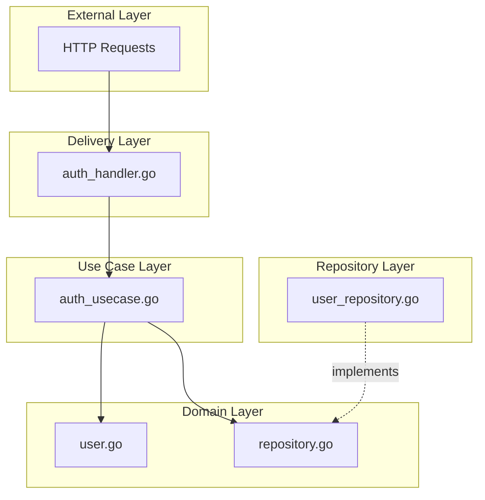

# Архитектура: 01 — Basic Auth (Base64) — Go

## Содержание

1. [Обзор проекта](#обзор-проекта)
2. [Basic Auth: как это работает](#basic-auth-как-это-работает)
3. [Точка входа: main.go](#точка-входа-maingo)
4. [Clean Architecture](#clean-architecture)
5. [Domain Layer (Доменный слой)](#domain-layer-доменный-слой)
6. [Repository Layer (Слой данных)](#repository-layer-слой-данных)
7. [Use Case Layer (Бизнес-логика)](#use-case-layer-бизнес-логика)
8. [Delivery Layer (HTTP и Middleware)](#delivery-layer-http-и-middleware)
9. [Полный Flow запроса](#полный-flow-запроса)
10. [Зависимости между слоями](#зависимости-между-слоями)
11. [Преимущества архитектуры](#преимущества-архитектуры)
12. [Резюме](#резюме)

---

## Обзор проекта

Этот мини-проект показывает базовую аутентификацию по **email + паролю** без сессий и токенов. Клиент передаёт email и пароль в JSON-теле запросов `/api/v1/auth/register`, `/api/v1/auth/login` и `/api/v1/auth/delete`. Пароли хранятся в виде bcrypt-хеша. Файл `middleware/auth.go` с Basic Auth оставлен как учебный пример и в текущем API не используется.

### Структура файлов (Go)

```
01-basic-auth/go/
├── cmd/
│   └── server/
│       └── main.go                          # Точка входа приложения
├── internal/
│   ├── domain/                              # Бизнес-модели и интерфейсы
│   │   ├── user.go                          # Модель User
│   │   └── repository.go                    # Интерфейс UserRepository
│   ├── repository/
│   │   └── memory/
│   │       └── user_repository.go           # In-memory реализация
│   ├── usecase/
│   │   └── auth_usecase.go                  # Регистрация, логин, bcrypt
│   └── delivery/
│       ├── auth_handler.go                  # HTTP handlers
│       └── middleware/
│           └── auth.go                      # Basic Auth middleware
├── go.mod
└── go.sum
```

### Кратко о терминах

- **Credentials (учётные данные)** — пара «логин + пароль», которой пользователь доказывает, что он тот, за кого себя выдаёт.
- **Middleware** — код, который выполняется до основного handler’а: например, проверяет авторизацию и только потом передаёт запрос дальше.
- **Context** — в Go это способ передать по цепочке вызовов значения (например, ID пользователя после проверки Basic Auth), не трогая сигнатуры функций.
- **Handler** — функция, которая обрабатывает HTTP-запрос: читает тело/заголовки, вызывает бизнес-логику и формирует ответ.

---

## Basic Auth: как это работает

**RFC 7617** описывает схему «Basic»: клиент кодирует строку `email:password` в **Base64** и отправляет в заголовке:

```
Authorization: Basic <base64(email:password)>
```

### Что такое credentials (учётные данные)

**Credentials** — это пара «кто ты» + «подтверждение личности»: в нашем случае **логин (email) и пароль (password)**. Клиент при каждом запросе к защищённому эндпоинту отправляет их в заголовке; сервер проверяет и решает, дать доступ или нет.

### Зачем Base64 (и почему «без пробелов и спецсимволов»)

Base64 здесь **не для шифрования** — его легко декодировать обратно. Он нужен из-за правил HTTP:

- Заголовки передаются как одна строка; пробелы часто считаются **разделителями** между частями заголовка.
- Символы вроде двоеточия `:` или кавычек могут по-разному обрабатываться серверами и прокси.
- В пароле могут быть пробелы, двоеточия, кириллица — всё это могло бы сломать разбор заголовка.

**Base64** превращает любую строку (в т.ч. `email:password`) в строку только из «безопасных» символов (буквы, цифры, `+`, `/`, `=`). Так значение заголовка передаётся **одним куском**, без неоднозначности. Итог: Base64 — про **безопасный формат для передачи в заголовке**, а не про секретность.

### Про HTTPS и открытый текст

По HTTP заголовки (и тело запроса) идут **открытым текстом**. Значит, и email, и пароль видны любому, кто перехватит трафик. Поэтому Basic Auth имеет смысл только по **HTTPS**: тогда канал шифруется и credentials не светятся в открытую.

### Как устроено у нас

- Есть отдельный эндпоинт `POST /api/v1/auth/login`: «вход» происходит через JSON-тело запроса (email + пароль).
- Клиент **не** использует заголовок Basic Auth; вместо этого все операции (`/register`, `/login`, `/delete`) принимают JSON `{ \"email\": \"...\", \"password\": \"...\" }`.
- Файл `middleware/auth.go` с Basic Auth оставлен как учебный пример: в нём показано, как Go читает заголовок `Authorization`, вызывает `r.BasicAuth()` и кладёт `user_id` в context, но в боевом маршруте он сейчас не используется.

---

## Точка входа: main.go

### Что создаётся в main.go (актуальный вариант)

```go
userRepository := memory.NewUserRepository()
authUsecase := usecase.NewAuthUsecase(userRepository)
authHandler := delivery.NewAuthHandler(authUsecase)

mux := http.NewServeMux()

// Public routes
mux.HandleFunc("/health", healthHandler)
mux.HandleFunc("/swagger", swaggerUIHandler)
mux.HandleFunc("/openapi.json", openAPIHandler)
mux.HandleFunc("POST /api/v1/auth/register", authHandler.RegisterHandler)
mux.HandleFunc("POST /api/v1/auth/login", authHandler.LoginHandler)
mux.HandleFunc("DELETE /api/v1/auth/delete", authHandler.DeleteByCredentialsHandler)
```

- **Repository Layer:** `memory.NewUserRepository()` — in-memory хранилище пользователей.
- **Use Case Layer:** `NewAuthUsecase` — бизнес-логика регистрации/логина/удаления.
- **Delivery Layer:** `NewAuthHandler` — HTTP-обработчики, которые принимают/отдают JSON.
- **Router:** `http.ServeMux` с маршрутом для каждого эндпоинта.

Сервер обёрнут в `http.Server` с таймаутами и graceful shutdown (ожидание SIGINT, `Shutdown(ctx)` с таймаутом).

### Clean Architecture (актуальный вид)



Код `middleware/auth.go` больше не участвует в обработке запросов — его можно читать отдельно как пример реализации Basic Auth, но он не влияет на текущий контракт API.

---

## Domain Layer (Доменный слой)

### Что делает этот слой

Domain описывает **сущности и контракты** приложения: как выглядит пользователь и какие операции с хранилищем нам нужны. Здесь нет кода работы с сетью или БД — только структуры и интерфейсы. Так бизнес-логика не привязана к конкретному способу хранения или доставки.

### domain/user.go — модель пользователя

```go
type User struct {
    ID        string    `json:"id"`
    Name      string    `json:"name"`
    Email     string    `json:"email"`
    Password  string    `json:"-"`           // НЕ возвращается в JSON
    CreatedAt time.Time `json:"created_at"`
}
```

**Зачем каждое поле:**

- **ID** — уникальный идентификатор пользователя (UUID). По нему ищем и обновляем запись; в URL/context передаём именно его.
- **Email** — логин пользователя и уникальный ключ «один email — один аккаунт».
- **Password** — в базе хранится только **хеш** пароля (bcrypt), не сам пароль. Тег `json:"-"` значит: при сериализации в JSON это поле **пропускается**, чтобы пароль нигде не уходил в ответах.
- **CreatedAt** — время регистрации (удобно для отображения и аудита).

### domain/repository.go — интерфейс хранилища

```go
type UserRepository interface {
    Create(user *User) error
    GetByID(id string) (*User, error)
    GetByEmail(email string) (*User, error)
    Delete(id string) error
}
```

**Зачем интерфейс:** use case вызывает только эти методы и не знает, откуда реально берутся данные (память, БД, другой сервис). Подмена реализации (например, memory → postgres) делается в одной точке — в main.go — без правок бизнес-логики.

**Зачем каждый метод:** Create — сохранить нового пользователя после регистрации; GetByID — достать пользователя по ID (если нужно получить профиль); GetByEmail — найти пользователя по логину при Login и при проверке «email уже занят» при Register; Delete — удалить пользователя по ID (удаление аккаунта).

---

## Repository Layer (Слой данных)

### Что делает этот слой

Репозиторий **хранит и достаёт пользователей**. Он не знает про HTTP, пароли или Basic Auth — только про «сохранить пользователя», «найти по ID», «найти по email», «удалить». Так мы можем заменить хранилище (память → БД) без изменения бизнес-логики.

### repository/memory/user_repository.go — пошагово

- **Хранилище:** `map[string]*domain.User` — словарь «ID пользователя → указатель на User». Данные живут в оперативной памяти; при перезапуске сервера всё пропадает (для учебного проекта этого достаточно).

- **Зачем RWMutex:** к серверу могут одновременно обращаться много клиентов. Без блокировки одна горутина могла бы читать map, пока другая его меняет — это приводит к панике. `sync.RWMutex` разрешает **много читателей** (RLock) или **одного писателя** (Lock), чтобы не было гонок.

- **Create:** берём Lock (эксклюзивный доступ), проверяем, что пользователя с таким ID ещё нет, записываем в map, отпускаем Lock. Если такой ID уже есть — возвращаем ошибку.

- **GetByID, GetByEmail:** берём RLock (одновременно могут читать другие), ищем в map, отпускаем RLock. GetByID — прямой доступ по ключу, O(1). GetByEmail — перебор всех пользователей в map (O(n)), потому что ключ у нас только ID; в реальной БД обычно делают индекс по email и поиск будет быстрым.

- **Delete:** берём Lock, удаляем запись из map по ID, отпускаем Lock.

---

## Use Case Layer (Бизнес-логика)

### Что делает этот слой

Use case содержит **правила приложения**: как зарегистрировать пользователя, как проверить логин/пароль, как получить или удалить пользователя. Он не знает про HTTP, заголовки или JSON — только про email, пароль, ID и вызовы репозитория.

### auth_usecase.go — пошагово

**Register(email, password):**

1. Вызываем `userRepository.GetByEmail(email)`. Если пользователь с таким email уже есть — возвращаем ошибку `"user already exists"` (handler отдаст 409 Conflict).
2. Хешируем пароль: `bcrypt.GenerateFromPassword(password)` — в хранилище попадает только хеш, не исходный пароль. При утечке БД пароли нельзя восстановить.
3. Создаём структуру User: ID = новый UUID (уникальный идентификатор), Email, Password = хеш, CreatedAt = текущее время.
4. Сохраняем пользователя в репозиторий: `userRepository.Create(user)`.
5. Возвращаем созданного user (handler потом отдаст его в JSON без поля password благодаря `json:"-"`).

**Login(email, password):**

1. Ищем пользователя по email: `userRepository.GetByEmail(email)`. Если не нашли — возвращаем ошибку `"invalid email or password"`.
2. Проверяем пароль: `bcrypt.CompareHashAndPassword(сохранённый_хеш, введённый_пароль)`. Если не совпало — снова возвращаем **ту же** ошибку `"invalid email or password"`.
3. Зачем одно и то же сообщение: иначе по разным ответам («пользователь не найден» vs «неверный пароль») можно было бы перебирать существующие email’ы (user enumeration). Один ответ для обоих случаев усложняет атаку.
4. Если всё ок — возвращаем user; HTTP‑handler формирует на основе него JSON‑ответ.

**GetUserByID(id):** просто запрос к репозиторию `GetByID(id)` и возврат пользователя или ошибки.

**DeleteUserById(id):** вызов `userRepository.Delete(id)`. Используется, когда нужно удалить аккаунт пользователя по его ID (например, после проверки email+пароль в другом методе).

---

## Delivery Layer (HTTP)

### Что делает этот слой

Delivery отвечает за **HTTP**: разбор запроса (JSON), вызов use case и формирование ответа (код состояния, тело). В актуальном варианте API авторизация происходит через JSON‑тело запросов, отдельное middleware не используется.

---

### auth_handler.go — актуальные handler’ы

**RegisterHandler (POST /api/v1/auth/register):**

1. Читаем тело запроса: `json.NewDecoder(r.Body).Decode(&req)` — ожидаем JSON с полями `email` и `password`. Если JSON битый или полей нет — отвечаем 400 Bad Request.
2. Вызываем `authUsecase.Register(req.Email, req.Password)`.
3. Если вернулась ошибка `"user already exists"` — отвечаем 409 Conflict (такой email уже зарегистрирован).
4. Любая другая ошибка — 500 Internal Server Error.
5. При успехе: статус 201 Created и JSON `{ "message": "Пользователь успешно зарегистрирован", "user": { ... } }`.

**LoginHandler (POST /api/v1/auth/login):**

1. Читаем JSON‑тело с `email` и `password`. При пустых полях — 400.
2. Вызываем `authUsecase.Login(email, password)`.
3. Если use case вернул ошибку `"invalid email or password"` — отвечаем 401 (но без разглашения, существует ли такой email).
4. При успехе формируем JSON‑ответ `{ "message": "Добро пожаловать!", "user": { ... } }`.

**DeleteByCredentialsHandler (DELETE /api/v1/auth/delete):**

1. Читаем JSON‑тело с `email` и `password`. При пустых полях — 400.
2. Вызываем use case `DeleteByCredentials(email, password)` (он внутри использует `Login`, а затем `DeleteUserById`).
3. Если логин/пароль неверные — 401.
4. При успехе возвращаем 200 OK и JSON `{ "message": "Пользователь успешно удалён" }`.

## Полный Flow запроса

Рассмотрим актуальный сценарий удаления аккаунта через `DELETE /api/v1/auth/delete`:

1. Клиент отправляет запрос:
   ```http
   DELETE /api/v1/auth/delete
   Content-Type: application/json

   { "email": "ivanov@example.com", "password": "1234" }
   ```
2. Запрос попадает в `DeleteByCredentialsHandler`.
3. Handler парсит JSON (email, password) и вызывает use case `DeleteByCredentials(email, password)`.
4. Use case внутри делает:
   - `Login(email, password)` → `GetByEmail` в репозитории → `bcrypt.CompareHashAndPassword`.
   - При успехе берёт `user.ID` и вызывает `DeleteUserById(id)` → `Delete` в репозитории.
5. Если логин/пароль неверные — из `Login` вылетает ошибка `"invalid email or password"`, handler отвечает 401.
6. Если всё прошло успешно — handler возвращает 200 OK и JSON `{ "message": "Пользователь успешно удалён" }`.

---

## Преимущества архитектуры

- **Тестируемость:** можно мокировать UserRepository и вызывать Use Case без HTTP.
- **Гибкость:** замена memory на postgres только в main.go.
- **Читаемость:** один слой — одна ответственность; HTTP‑handlers не знают о деталях хранения, а use case — о HTTP.

---

## Резюме

**Реализовано:** аутентификация по email+паролю, bcrypt для паролей, аккуратное разделение слоёв (Domain / Use Case / Repository / Delivery), JSON‑контракт с единым форматом ответов.

**Следующий проект (Go):** [02-api-key](../../02-api-key/go/ARCHITECTURE.md) — авторизация по заголовку X-API-Key.
